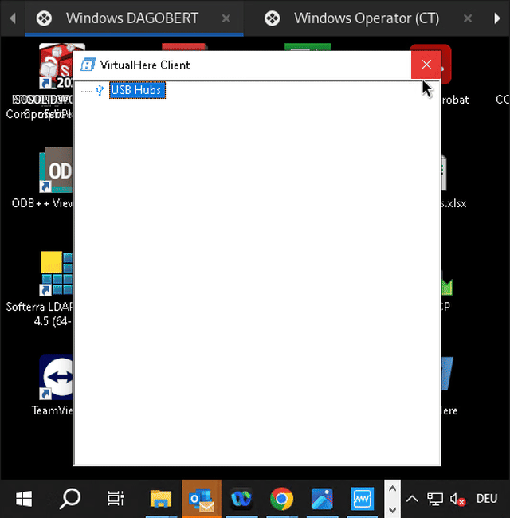

[TOC]

# SAFION - Inspectrum

This repository includes information regarding the Inspectrum.C device manufactured by Safion. Beside other things, the devices' firmware, Digatron integration, software installation are provided here.

## Using the Inspectrum.C device

The Inspectrum.C device can be controlled either via USB or via CAN bus. Both methods require some form of additional license. A quick comparison is given in the following table:

| Control via ..                             | USB                  | CAN                  |
|--------------------------------------------|----------------------|----------------------|
| Stimulation/Acquisition fully configurable | :white_check_mark:   | :x:                  |
| Integration with Digatron programs         | :x:                  | :white_check_mark:   |
| License Type                               | ~Hardware~ Software  | Hardware             |
| Additional PC required                     | :white_check_mark:   | :x:                  |
| Multiplexer usable                         | :white_check_mark:   | :white_check_mark:   |

In a nutshell, usage via USB is flexible, while usage via CAN bus is suited better for long term measurements.

### Control via USB

#### Prerequisites

Requires a PC or laptop with the Safion Inspectrum Suite and VirtualHere installed. Both softwares can be found inside the ISEA Software Center. Installing the Safion Inspectrum Suite requires approximately 30 minutes.

#### License

The Safion Inspectrum Suite requires a software license which is normally distributed by CodeMeter USB Stick. In order to prevent early loss of license USB sticks, hardware license sticks should not be used if permanent access to the ISEA networks is possible. Inside the testing containers of the CARL building permanent access is indeed possible. Instead of using the hardware license sticks, licenses can be borrowed using [VirtualHere](https://www.virtualhere.com/), which allows tunneling the USB protocol over IP-based networks.

The following video shows the process of borrowing a license. A textual description is given below the video.

{width=500}

If you reinstall VirtualHere, the following steps are necessary:
1. Start VirtualHere
2. If you are not in one of the networks where Auto-Find Hubs works, add the licensedonglehub manually
    1. Right-Click USB Hubs
    2. Select "Specify Hubs..."
    3. Click "Add"
    4. Enter `licensedonglehub:7575` and click "Ok"
    5. Click "Close"

If you want to borrow a license, the following steps are necessary:
1. Start VirtualHere (either by Start Menu or by clicking the VirtualHere tray icon)
2. Double-click the license you want to borrow (Most of the Inspectrum* licenses available are equal, some have additional licenses for plugins of the Inspectrum Software Suite)
3. The license should now appear with a bold font and Windows should signal the insertion of an USB device

After you have conducted your tests, please disconnect from the license. The following steps are necessary:
1. Start VirtualHere (either by Start Menu or by clicking the VirtualHere tray icon)
2. Double-click the bold-fonted license you want to disconnect from
3. The license should now appear normal-fonted

The following table gives overview about the different networks and the need to add the usb hub explicitly.

| Network               | IP subnet           | Need to add `licensedonglehub:7575` explicitly |
|-----------------------|---------------------|------------------------------------------------|
| Office network        | `137.226.252.0/23`  | :x:                                            |
| JS laboratory network | `192.168.252.0/24`  | :white_check_mark:                             |
| Logger network        | `10.1.0.1/24`       | :x:                                            |
| VPN network           | `172.23.47.128/25`  | :white_check_mark:                             |

#### Usage Inspectrum Suite

The "normal" usage of the software is well described inside the manual itself. Therefore, only special operations are described here:

Firmware Update

_*TODO*_ Add images

During the firmware update, the software might fail during resetting of the device, which is due to a bug in older firmware versions. To solve this problem, the Inspectrum device must be resetted manually:
1. Start Inspectrum
2. Start Software
3. Select "Device" -> "Advanced" -> "Update device firmware ..."
4. Select the correct firmware file (Download from [41_Firmware](41_Firmware)). Make sure that the firmware file is intended for the hardware revision of the device. The firmware file's name is `encryptedInspectrumFirmware_Standalone__HW_<HWversion>_SW_<SWVersion>_<SoftwareReleaseDate><stuff>.bin`. The device's hardware version can be found inside the subwindow "Device Configuration" -> tab "Device Information" -> "Hardware revision"
_*TODO*_

# Control via CAN

## Prerequisites

*_TODO*_

## General

CAN Communication with the Inspectrum follows a request-response scheme, where communication is always initiated by the master. A more precise description of the different commands/requests and responses is given in [20_dbc_file](20_dbc_file).

*_TODO_*
