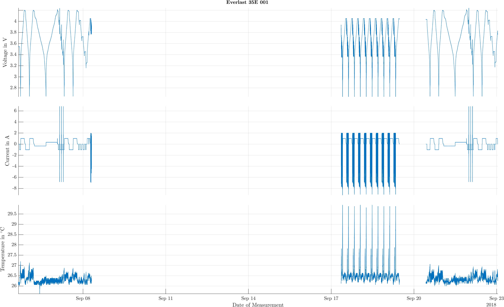
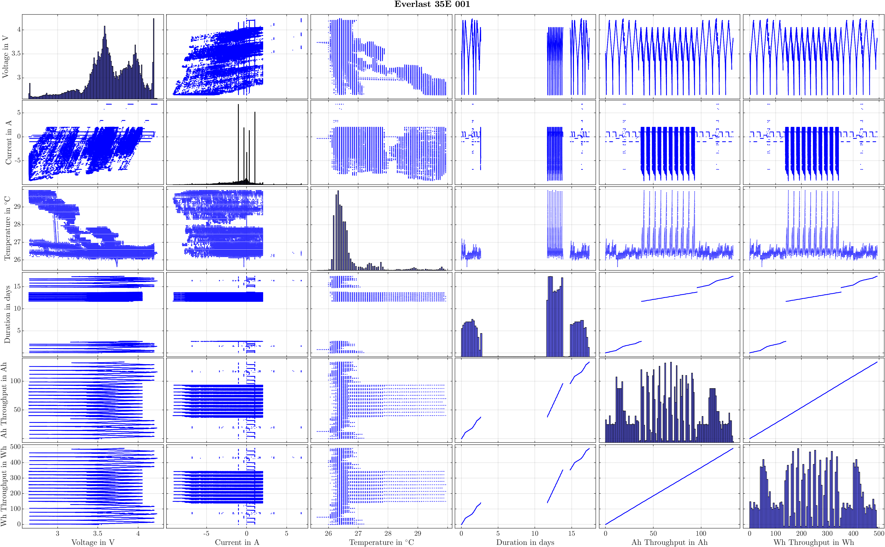
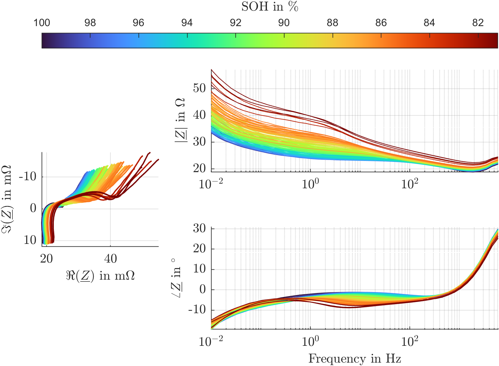
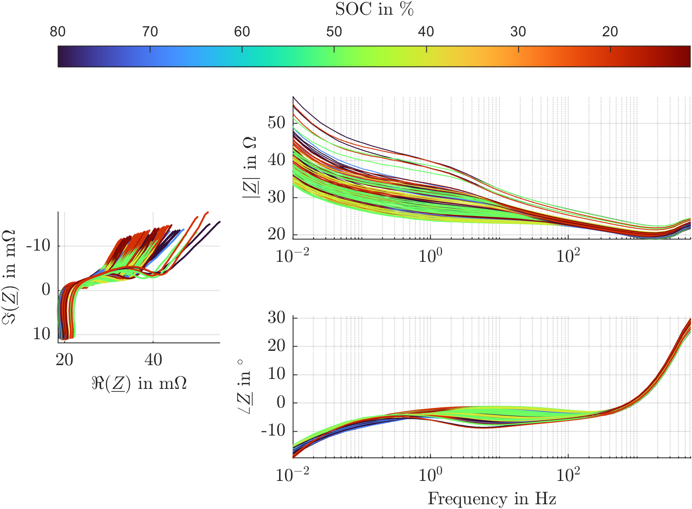
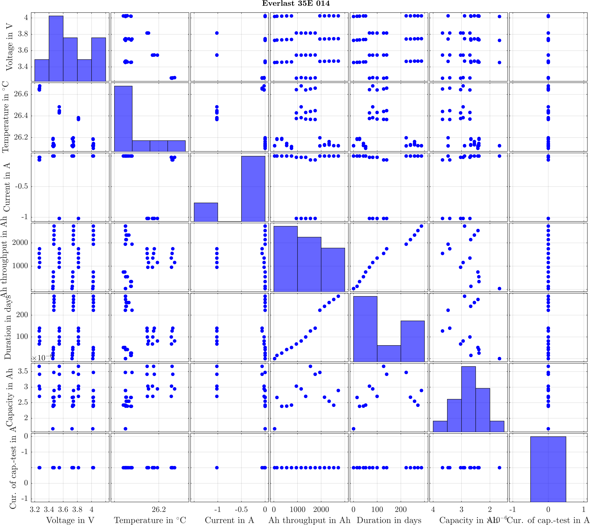
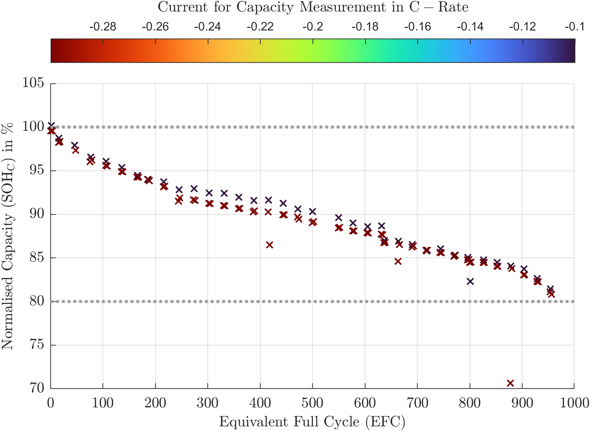
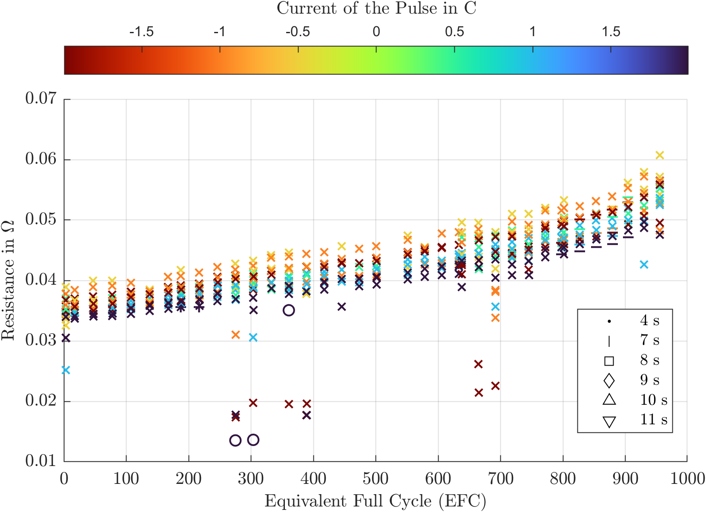

# TTconverter
**to TimeTable converter**

<a href="https://www.carl.rwth-aachen.de/?lidx=1" target="_blank">
    
</a>

[](https://opensource.org/licenses/MIT)


This project converts data downloaded with [NANU](https://git.isea.rwth-aachen.de/ESS/ahjo/nanu) to timetables in Matlab. A csv. exports are possible. It was developed to extract EIS data, but other functions exist.


<ins> ToDo </ins>
- [ ] Improve capacity estimation
- [ ] Add functionality to scan only new files. In "all_files.date" the filedate is already extracted.
- [ ] Optimise the temperature extraction. Toooo many different names for an easy solution.
- [ ] Robust OCV,DVA and ICA. Start with copying the plot method from EIS
- [ ] Additional Ageing analysis scripts, e.g. duration for x axis or many cells combined
- [ ] Change all scripts to functions and add a "run_all.m" script
- [ ] Pulse export

## Example

### Folders

All new folders are generated automatically. Required is only ```data\converted``` where nanu saved data.

```bash
└───ttconverter
    ├───01_misc
    ├───10_convert_from_nanu
    ├───11_Cap_Eval
    ├───12_OCV_extract
    ├───21_EIS_processing
    ├───31_Extract_Statistics
    ├───32_Ageing_Analysis
    └───91_Rename
...
├───data
    ├───converted
    ├───eis_data
    ├───export
    ├───figures
    ├───ocv_data
    └───timeseries
```

### Implemented Functions

#### 10_convert_from_nanu

1. run [a_list_available_cells.m](10_convert_from_nanu/a_list_available_cells.m)
2. run [b_convert_to_timetable.m](10_convert_from_nanu/b_convert_to_timetable.m)
3. run [c_combine_timetables.m](10_convert_from_nanu/c_combine_timetables.m)
4. run [d_clean_timetables.m](10_convert_from_nanu/d_clean_timetables.m)
5. run [e_add_ah_and_wh_throughput.m](10_convert_from_nanu/e_add_ah_and_wh_throughput.m)
6. run [f_preevaluate_timetables.m](10_convert_from_nanu/f_preevaluate_timetables.m)
7. (OPTIONAL) run [X_export_timetables.m](10_convert_from_nanu/X_export_timetables.m)

The 1. step will collect all cells from data/converted and create/update an excel file "cells.xlsx" in the folder data.
This excel file, can be modified by the user and defines which cells should be converted or not.

The 2. step converts all "nanu" files into a single timetable per cell.

The 3. is only necessary if your tests have used different names for the same cell. E.g. "Bat2020_G1_ISEA33_EIS" and "Bat2020_G1_ISEA33". NEVER do so!!! Only use one name in ahjo for the same cell.

The 6. will generate figures giving an overview of the tests performed per cell. They will be stored in the folder figures. You can run this script again, e.g. after adding capacity. Right now there is a limit of 10000000 rows added. If more exists, they are subsampled. 10000000 requires about 15 GB RAM and it takes about 10 min to finish.

 

#### 11_Cap_Eval

1. run [a_capacity_estimation.m](11_Cap_Eval/a_capacity_estimation.m)
1. run [b_resistance_estimation.m](11_Cap_Eval/b_resistance_estimation.m)

The 1. will search for full charges or discharges and extract from those the capacity and adds a column for this.

The 2. is searching for current pulses below 120 s and then analysies if this was a pulse or not. If so, it is evaulated.

#### 12_OCV_extract

1. run [a_OCV_extract.m](12_OCV_extract/a_OCV_extract.m)
2. (OPTIONAL, unstable) run [x_plot_all.m](12_OCV_extract/x_plot_all.m)
3. (OPTIONAL, unstable) run [x_plot_dva.m](12_OCV_extract/x_plot_dva.m)
4. (OPTIONAL, unstable) run [x_plot_ica.m](12_OCV_extract/x_plot_ica.m)
5. (OPTIONAL, unstable) run [x_plot_ocv.m](12_OCV_extract/x_plot_ocv.m)

The 1. will search for complete charges or discharges and generates a new timetable only containing those. This can be used in the other scripts to generate OCV, DVA and ICA figures.

#### 21_EIS_processing

1. run [a_timetable_to_EISonly_timetable.m](21_EIS_processing/a_timetable_to_EISonly_timetable.m)
2. (OPTIONAL) run [zz_plot_EIS.m](21_EIS_processing/zz_plot_EIS.m)
3. (OPTIONAL, needs to be updated) run [zz_preevaluate_EIS_all.m](21_EIS_processing/zz_preevaluate_EIS_all.m)

The 1. step will extract from the complete timetables generate with the scripts in /10_convert_from_nanu/ only the EIS results. Furthermore it will search for the latest "not EIS results". Thus each EIS measurement will have the latest voltage/temperature. Furthermore SOC and SOH will be calculated based on the latst capacity extracted before.

|Time | Current | Voltage |  Temperature |  EIS_Frequency |  EIS_Z_abs |  EIS_Z_phase |
|--------|--------|--------|--------|--------|--------|--------|
| 2018-09-07 22:01:13.030000 | 0 | 4.01537250354886 | 25.8124000000000 | NaN | NaN | NaN |
| 2018-09-07 22:01:17.240000 | NaN | NaN | NaN | 6000 | 21.7415401260078 | 29.9284854127036 |

**converted to**

|Time | Current | Voltage |  Temperature |  EIS_Frequency |  EIS_Z_abs |  EIS_Z_phase | AH_throughput | EIS_measurement_id |
|--------|--------|--------|--------|--------|--------|--------|--------|--------|
| 2018-09-07 22:01:13.030000 | 0 | 4.01537250354886 | 25.8124000000000 | 6000 | 21.7415401260078 | 29.9284854127036 |

The 2. and the 3. script can extract / evaluate the EIS data. The 2. gives an overview of tests done. The 3. extracts EIS measurements and plots them.








#### 31_Extract_Statistics

1. run [a_Extract_Statistics.m](31_Extract_Statistics/a_Extract_Statistics.m)

This script generates an excel file with fundamental statistics extracted from the timetable.

#### 32_Ageing_Analysis

1. run [a_capacity_fade_analysis.m](32_Ageing_Analysis/a_capacity_fade_analysis.m)






For now only individual cells can be plotted over EFC.

#### 91_Rename

1. (OPTIONAL) run [zz_rename_files.m](91_Rename/zz_rename_files.m)

In case you need to anonymize your you can use this script. It requries an excel file with two columns, one "CellNameISEA" and one named "CellNameExtern".


## Required Software

- MATLAB (developed with 2021B, not tested with other versions yet)

## Colophon

If heavily used, feel free to add as coauthor: <a href="https://orcid.org/0000-0003-0943-9485">Alexander Blömeke </a>
To get help mail: [Alexander Blömeke](mailto:alexander.bloemeke@isea.rwth-aachen.de?subject=[Git]%20TTconverter)

### License

This project is licensed according to the file [LICENSE](/LICENSE "LICENSE").

### Acknowledgement

The authors acknowledge the financial support by the Federal Ministry of Education and Research (BMBF) of Germany in the project OSLiB (project number 03X90330A) within the competence cluster Battery Utilisation Concepts (BattNutzung).


<a href="https://www.bmbf.de/bmbf/en" target="_blank">
    
</a>
<a href="https://www.battnutzung-cluster.de/en/projects/oslib/" target="_blank">
    
</a>
